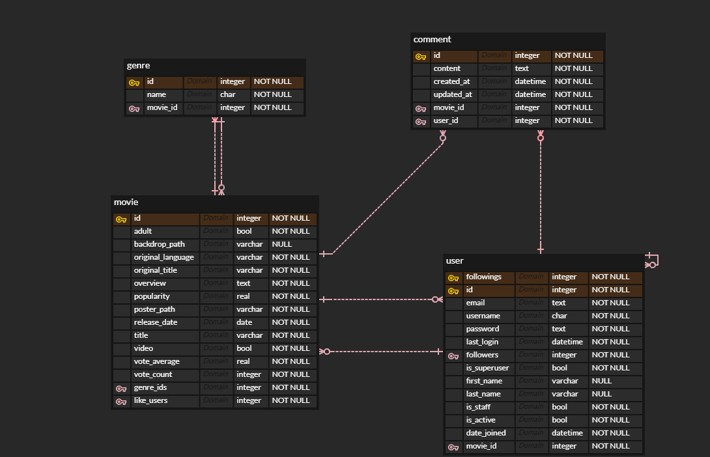
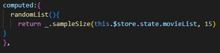
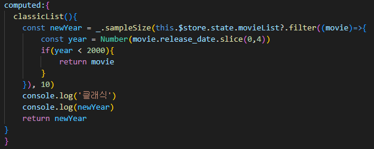
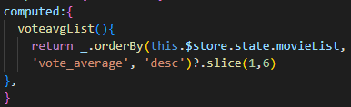
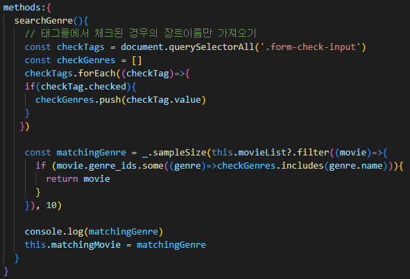
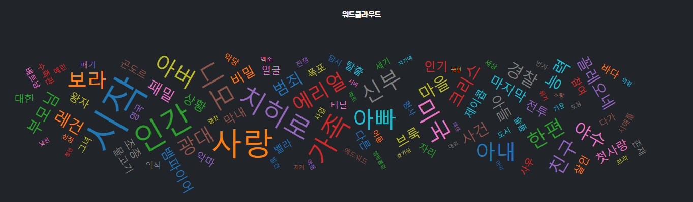
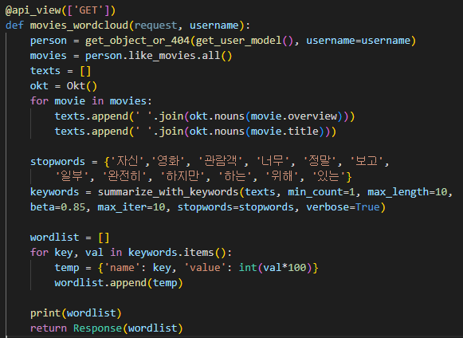

## 1. 팀원 정보 및 업무 분담 내역

----

1. 박윤아(팀장) - 백(대부분의 기술구현) 프론트(검색 등)

2. 김창영(팀원) - 프론트, css, 발표

## 2. 목표 서비스 구현 및 실제 구현 정도

----

1. 검색, 추천(랜덤, 선택 장르, 클래식, 평점)

2. 로그인, 회원가입, 로그아웃
   
   * 회원가입 시 이미 사용중인 아이디인지 사용 가능한 아이디인지 띄워줌
   
   * Remember ID 클릭 시 아이디 기억해 놓고 다음 로그인 시 사용가능

3. 프로필, 팔로우, 좋아요 목록

4. 영화 좋아요, 댓글, 댓글 삭제

## 3. 데이터베이스 모델링 (ERD)

-----

## 4. 영화 추천 알고리즘에 대한 기술적 설명

----

1. 랜덤
   
   * store에 저장된 영화 목록으로 들어간다.
   
   * lodash의 sampleSize함수를 사용해서 15개의 영화를 추천한다.

   

2. 클래식
   
   * store에 저장된 영화 목록으로 들어간다.
   
   * 각각의 영화 release_date에서 fliter와 slice를 활용해서 2000년 이전의 영화만 모은다.
   
   * lodash의 sampleSize함수를 사용해서 10개의 영화를 추천한다.

   

3. 평점
   
   * lodash의 orderBy함수를 사용해서 vote_average의 데이터와 desc를 이용해 내림차순으로 정렬한다.
   
   * slice로 5개의 영화를 추천해 준다.

   

4. 장르
   
   * 체크박스 요소들을 queryselectorAll 을 활용해서 가져온다.
   
   * 각각의 체크 박스가 체크되어 있는지 foreach를 이용해서 확인 후 체크 되어있으면 장르 이름을 저장한다.
   
   * 저장된 장르들이 해당되는 영화들을 filter를 이용해 추출하고 lodash를 이용해 10개의 영화를 추천한다.

   

## 5. 서비스 대표 기능에 대한 설명

----

1. 워드클라우드 (글에서 언급된 핵심 단어를 시각화하는 기법)
   
   * 유저가 좋아요한 영화 목록을 불러온다.
   
   * konlpy패키지의 Okt()를 활용해서 영화 목록의 overview와 title을 명사만 따로 추출한다.
   
   * 불필요한 단어를 거를 stopwords 목록을 만들고 단어별 빈도수를 세어 넘겨준다.
   
   * vue의 wordcloud 패키지를 활용해서 단어 빈도별 크기를 나타낸 그림을 그린다.
   
   
   

## 6. 기타 (느낀 점, 후기 등)

----

1. 프론트와 백을 연결하는 점에 어려움을 느꼈다.

2. 정확한 알고리즘을 구현하는 것이 어렵다는 것을 느꼈다.

3. 기획 단계가 매우 중요함을 느꼈다.

4. 역할 분담이 중요하다는 것을 느꼈다.
   
   * merge 할 때 충돌이 생기지 않도록

5. 보이는 부분(css)이 중요하다는 것을 느꼈다.

6. 진행 내용 체계적으로 기록하는 것에 어려움을 느꼈다.
